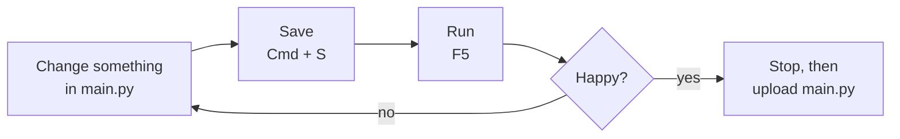
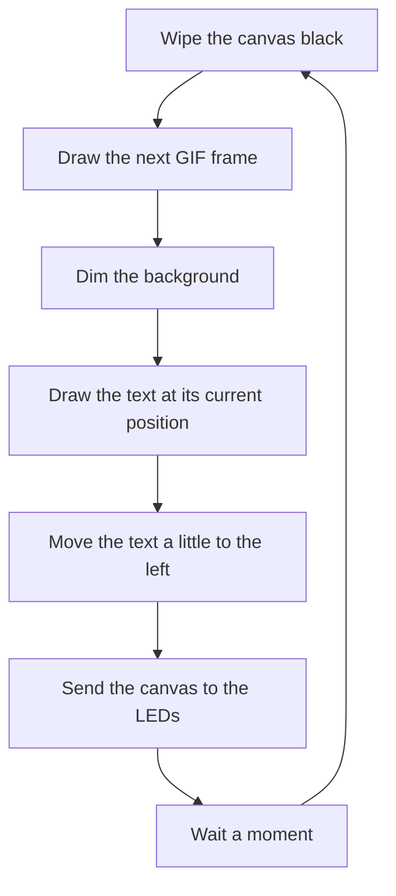

# Introduction to LED Signage

A workshop where students program an LED Sign using LED Matrix Panels (128x64 and 64x64) and the Pimoroni Interstate 75W LED matrix driver.

By the end of the session you'll have made your own LED sign: an animated background of your choosing, with your own words, in your own font, scrolling over the top.

The learning objectives are:
- Embracing play and experimentation when faced with unfamiliar technology.
- Using niche tools to prepare media for low-resource platforms like microcontrollers.
- Creatively working within the hard limitations of low-resource platforms.


**You do not need any programming experience, this workshop is designed for novice creative computing students.** Every step is written out below. If something goes wrong (and it will) check the [troubleshooting table](#troubleshooting) and then shout for help.

## What's on your desk

- An LED matrix panel (64x64 or 128x64) with a Pimoroni Interstate 75W already attached to the back.
- A USB-C cable.
- A computer with this folder (`Intro-to-LED-Signage`) already on it.

> **[FIGURE 0.1 — placeholder]** Photo of the workshop kit laid out on a desk: panel, Interstate 75W, USB-C cable.

## What's in this folder

| Folder / file | What it is |
| --- | --- |
| [README.md](README.md) | This document, the workshop itself. |
| [example/main.py](example/main.py) | The main example: a looping GIF with pink scrolling text. **This is the file you'll be changing.** |
| [example/gif](example/gif) | The frames of the background animation, as individual PNG images. |
| [example/fonts](example/fonts) | The font used by the sign, in the lightweight `.af` format. |
| [alternative-example/main.py](alternative-example/main.py) | A second example that *generates* its background with code instead of using a GIF (Section 2). |
| [setup/install-tools.sh](setup/install-tools.sh) | For technicians only, see the [appendix](#appendix-preparing-the-workshop-computers). |

---

## Section 1: Technology Overview and Getting Started

### Part 1.1: Hardware

This workshop is primarily to become familiar with low-resource computing platforms. What do we mean by low-resource in this context? 

These LED Panels are usually part of giant video walls made up of 100s of these panels driven by multiple GPUs in powerful media servers (Which can be seen at the IVSL at the Institute of Creative Technology down the road at Havers Road.).

In this workshop we are using a hardware platform many orders of magnitude less powerful: the RP2350 microcontroller, which is at the heart of the Pimoroni Interstate 75W Matrix Driver. Low resource hardware like this is usually called "embedded" hardware. It gets used when a full computer with an operating system would be overkill, bringing unnecessary technical overhead, power requirements and a high economic cost (especially with the current price of computer memory!).

Just how much less powerful are we talking?

| | High-end rendering computer / media server | Interstate 75W (RP2350) |
| --- | --- | --- |
| **Processor** | 32+ cores at ~4–5 GHz | 2 cores at 150 **MHz** |
| **Graphics** | One or more dedicated GPUs, each with 24–48 GB of video memory | None, every pixel is worked out by the processor |
| **Memory (RAM)** | 128–512 GB | 520 **KB** |
| **Storage** | Several TB of SSD | 4 **MB** of flash |
| **Operating system** | Windows / Linux | None, it runs code directly |
| **Power** | 1000 W+ | Well under 1W (the LEDs are another story!) |
| **Cost** | £10,000s | £15 |

That's roughly **half a million times less memory** than a high-end machine. There's no GPU, no operating system and no desktop. Just our code, running directly on the chip.

> **[FIGURE 1.1 — placeholder]** Photo of the back of a panel with the Interstate 75W plugged in, labelling: the RP2350 chip, the USB-C port, the BOOT / RST / A / B buttons, the HUB75 connector and the power terminals.

Usually when displaying media on displays you are working with large resolutions like HD (1280x720), FHD (1920x1080) and even UHD (3840x2160). Here we have 64x64... such a limitation requires us to think hard about making images and text legible.

| Resolution | Total pixels | Compared to our panel |
| --- | --- | --- |
| UHD (3840x2160) | 8,294,400 | ~2,000 times more |
| FHD (1920x1080) | 2,073,600 | ~500 times more |
| HD (1280x720) | 921,600 | ~225 times more |
| **Our 128x64 panel** | **8,192** | 2 times more |
| **Our 64x64 panel** | **4,096** | - |

The whole of our 64x64 panel has fewer pixels than a single app icon on your phone. Every pixel counts!

> **[FIGURE 1.2 — placeholder]** The same photo shown at 1920x1080 and at 64x64, side by side, to show how much detail disappears.

### Part 1.2: Software

The RP2350 is programmed with a programming language called **MicroPython**. This is a subset of the Python programming language targeting low-resource hardware such as microcontrollers. It's the same Python you might have seen elsewhere, with some of the heavier parts removed so it fits on a tiny chip.

To transfer files and write our code we are using a text editor called **Thonny**.

We are also using a few software tools that are preinstalled on your computers. These are *command line* tools: they don't have windows or buttons, and are used by typing commands into the **Terminal** application on your computer.

- **`ffmpeg`**: for converting GIFs into low-res individual frames.
- **`afinate`**: part of [Alright Fonts](https://github.com/lowfatcode/alright-fonts/tree/feature/port-to-c17) (the `feature/port-to-c17` branch to be precise), used to convert fonts into the lighter `.af` font format.

#### Check your tools work

1. Press <kbd>Cmd</kbd> + <kbd>Space</kbd>, type **Terminal** and press <kbd>Enter</kbd>. A window with a blinking cursor will open. This is the Terminal.
2. Type the following and press <kbd>Enter</kbd>:

   ```
   ffmpeg -version
   ```

   You should see a line starting with `ffmpeg version ...` followed by a lot of other text. That's fine!
3. Now type the following and press <kbd>Enter</kbd>:

   ```
   afinate --help
   ```

   You should see a line starting with `usage: afinate ...`.

If either one says `command not found`, put your hand up and we'll sort it out.

> **[FIGURE 1.3 — placeholder]** Screenshot of the Terminal after running both commands successfully.

Keep the Terminal open. We'll need it in Sections 2 and 3.

### Part 1.3: Getting Started

Let's get the example running on your sign. The steps are the same every time, so once you've done it once you've got the hang of it.

#### Step 1: Plug in

Plug the USB-C cable into the Interstate 75W on the back of the panel, and the other end into your computer. The panel might light up straight away with whatever was on it last. That's fine.

#### Step 2: Open Thonny and connect to the board

1. Open **Thonny** (press <kbd>Cmd</kbd> + <kbd>Space</kbd>, type **Thonny**, press <kbd>Enter</kbd>).
2. Look at the **bottom-right corner** of the Thonny window. Click the text there (it might say *Local Python 3*) and pick **MicroPython (RP2040)** from the list. It might instead say *MicroPython (Raspberry Pi Pico)*, which works too. Both work with our RP2350.
3. At the bottom of the Thonny window is the **Shell**. Once connected it will show something like `MicroPython v1.xx ... Interstate 75W` and a `>>>` prompt.
4. Click the red **Stop** button in the toolbar. This stops whatever the board was already running so we can talk to it.

> **[FIGURE 1.4 - placeholder]** Screenshot of Thonny with the interpreter menu open in the bottom-right corner, "MicroPython (RP2040)" highlighted.

> **[FIGURE 1.5 - placeholder]** Screenshot of the Thonny Shell showing the MicroPython banner and `>>>` prompt, with the Stop button circled.

#### Step 3: Show the files

1. In the menu bar click **View -> Files**. A panel appears on  the left, split in two:
   - The **top half, "This computer"**, is the files on your computer.
   - The **bottom half** (labelled *Raspberry Pi Pico* or *MicroPython device*) is the files on the board.
2. In the top half, find your way to the `Intro-to-LED-Signage` folder, then double-click the **example** folder to go inside it. You should see `fonts`, `gif` and `main.py`.

> **[FIGURE 1.6 - placeholder]** Screenshot of the Thonny Files panel, with "This computer" showing the example folder and the board's files underneath.

#### Step 4: Upload the font and the GIF frames to the board

Our code runs on the board, so everything it needs (the font and the animation frames) has to be on the board too.

1. In the **top half** (This computer), **right-click** the `fonts` folder and choose **Upload to /**.
2. Do the same for the `gif` folder: **right-click -> Upload to /**. This one takes a little longer; there are probably a lot of frames!
3. Check the **bottom half** (the board). You should now see `fonts` and `gif` folders there.

> **[FIGURE 1.7 - placeholder]** Screenshot of the right-click menu on the `gif` folder with "Upload to /" highlighted.

#### Step 5: Run the example

1. In the top half, **double-click `main.py`**. It opens in the editor.
2. Click the green **Run** button (or press <kbd>F5</kbd>).
3. Look at your sign! You should see the looping animation with pink text scrolling across it: the Litany Against Fear from Dune.

> **[FIGURE 1.8 - placeholder]** Photo of the sign running the example.

Pressing **Run** sends the code from your computer to the board and runs it there, but only until the board is unplugged.

#### Step 6: Make it stick

To make the sign run on its own (plugged into a USB power supply, with no computer), the code needs to live *on the board* and be called `main.py`. When the board powers up, it always looks for a file called `main.py` and runs it.

1. Click **Stop**.
2. In the top half, **right-click `main.py`-> Upload to /**. If Thonny asks whether to overwrite, say yes.
3. Unplug the USB cable and plug it back in. The sign should start by itself.

#### The loop you'll use for the rest of the workshop



- If you change the **code**, just Save and Run.
- If you add **new files** (frames or fonts), upload them to the board first.
- If Thonny won't respond or says the device is busy, click **Stop** and try again.

#### A tour of `main.py`

Open [example/main.py](example/main.py) and scroll through it. Every line has a comment above it starting with `#`, explaining what it does in plain English. The board ignores comments when running the code. The file is in four parts:

| Lines | Part | What it does |
| --- | --- | --- |
| [11–27](example/main.py#L11-L27) | **Libraries** | Prewritten code for generic function: the display driver, the PNG decoder and the font renderer. |
| [31–83](example/main.py#L31-L83) | **Settings** | The main things you are changing today: the message, the colours, brightness, sizes, speeds and file names. |
| [87–118](example/main.py#L87-L118) | **Functions** | Two named helpers: one makes a dimmed pen for the text, the other dims the whole background. |
| [122–197](example/main.py#L122-L197) | **Setup** | Runs once at the start: switches on the panel, loads the font and finds all the frames. |
| [201–259](example/main.py#L201-L259) | **Main loop** | Runs forever, once per frame: draws the background, draws the text, shows it on the LEDs, waits a moment, repeats. |

The main loop is the heart of it. Every single frame, the board does this:



Notice that nothing appears on the panel until [line 256](example/main.py#L256) (`i75.update()`). Until then the board is drawing onto an invisible canvas in memory. Only once the whole frame is ready do we send it to the LEDs in one go, so you never see half-drawn frames.

#### Your first change

Let's make a change to prove it's really yours.

1. Find the `SCROLL_SPEED` setting on [line 65](example/main.py#L65). Change the `1` to `3`.
2. Find `TEXT_COLOUR` on [line 59](example/main.py#L59). The three numbers are **red, green, blue**, each from `0` (off) to `255` (full brightness). Try `(0, 255, 0)` for green.
3. Save (<kbd>Cmd</kbd> + <kbd>S</kbd>) and Run (<kbd>F5</kbd>).

Fast green text! Change them back (if you want, it's your sign) and let's move on.

#### Troubleshooting

When something goes wrong, the Shell at the bottom of Thonny shows an error in red. The **last line** is usually the useful one.

| You see | What it means | Fix |
| --- | --- | --- |
| `OSError: [Errno 2] ENOENT` | The board can't find a file. | Check the `fonts` / `gif` folders are on the board (bottom half of the Files panel), and that `FONT_FILE` ([line 47](example/main.py#L47)) and `GIF_FOLDER` ([line 38](example/main.py#L38)) exactly match the names on the board. Capital letters matter! |
| `ZeroDivisionError` or `IndexError` | The GIF folder is there but has no PNG files in it. | Re-upload your frames. |
| `SyntaxError` | A typo in the code. | Look at the line number in the error. Common culprits: a missing quote mark `"`, or a missing bracket `)`. |
| `ImportError: no module named 'interstate75'` | Thonny is connected to the wrong thing, or the board's firmware is missing. | Check the bottom-right corner of Thonny says MicroPython. If it does, ask for help. |
| `Device is busy` / nothing happens | The board is still running the old code. | Click **Stop** and try again. If that doesn't work, unplug and replug the USB cable. |
| Colours look wrong (red is blue, etc.) | Some panels wire their colours in a different order. | Ask for help. There's a `color_order` setting for this ([docs](https://github.com/pimoroni/interstate75/blob/main/docs/README.md#colour-order)). |
| The sign is blank but there are no errors | The text or frames might be drawing off-screen. | Check `TEXT_Y` ([line 56](example/main.py#L56)) is between 0 and 64. |

---

## Section 2: Background Animation

First we are going to change the background animation. There are two options:

- **Option A: use a downscaled GIF**, just like the main example.
- **Option B: create a background animation programmatically**, generating it with code as it runs.

Try whichever grabs you. If you've got time, try both!

### Option A: A downscaled GIF

#### Picking a GIF

We are about to squash a GIF down to 64x64 pixels (or 128x64). Most of the detail is going to disappear, so choose something that will survive that. Some advice:

**Good choices:**
- **Bold shapes and big areas of colour.** Think fire, lava lamps, water, clouds, smoke, abstract loops.
- **Pixel art and retro video games.** They were designed for tiny screens in the first place! (Pimoroni recommend [1jps.tumblr.com](https://1jps.tumblr.com/).)
- **High contrast.** Bright things on dark backgrounds look amazing on LEDs. Black is just LEDs switched off, so it's a true, deep black but keep in mind you are running text over it.
- **Seamless loops.** Where the last frame flows back into the first, so there's no sudden jump.
- **Short.** A few seconds is plenty (see the note on storage below).

**Things that won't survive:**
- Text inside the GIF. It will turn to mush, and we're adding our own text anyway.
- Faces and people far away, fine detail and busy scenes.
- Very fast flickering or lots of cuts between shots.
- GIFs that are prodominently a similar colour to your text colour. Your text needs to stand out!

Good places to look: [GIPHY](https://giphy.com/), [1jps.tumblr.com](https://1jps.tumblr.com/), or make your own.

**Download your GIF to your Downloads folder.** Give it a simple name with no spaces, like `fire.gif`.

> **[FIGURE 2.1 — placeholder]** A few example GIFs shown at original size and at 64x64: some that work well (fire, pixel art) and some that don't (a crowd scene, a GIF with text).

#### Meet ffmpeg

`ffmpeg` is one of the most important pieces of open-source software ever written. Since 2000 it has been built and maintained by volunteers, and it can read, convert, cut, resize and filter almost any video, audio or image format in existence. Chances are it's secretly running inside software you use every day: VLC, OBS, Blender, Web browsers and many of the big online video streaming platforms all use it in their codebases. It has no buttons or windows; you tell it what to do by typing a command into a terminal. We're going to use it to turn an animated GIF into a folder of tiny PNG frames.

#### Step 1: Go to the example folder in the Terminal

1. In the Terminal, type `cd` followed by a **space**. Don't press Enter yet!
2. Open Finder, find the `Intro-to-LED-Signage` folder, and **drag the `example` folder into the Terminal window**. Its location gets typed in for you.
3. Now press <kbd>Enter</kbd>.

`cd` means "change directory". It tells the Terminal which folder to work in.

> **[FIGURE 2.2 — placeholder]** Screenshot/GIF of dragging the `example` folder from Finder into the Terminal after typing `cd `.

#### Step 2: Make a folder for your frames

Type this and press <kbd>Enter</kbd>:

```
mkdir my-gif
```

`mkdir` means "make directory". You've just made a new, empty folder called `my-gif` inside `example`.

#### Step 3: Convert the GIF

Type this all on one line (or copy and paste it), changing `fire.gif` to the name of your GIF, and press <kbd>Enter</kbd>:

```
ffmpeg -i ~/Downloads/fire.gif -vf "fps=15,scale=64:64:force_original_aspect_ratio=increase:flags=area,crop=64:64" my-gif/frame_%03d.png
```

**Using a 128x64 panel?** Change both `64:64`s to `128:64`.

This looks scary, but it's just a list of instructions. Here's what each bit means:

| Part | Meaning |
| --- | --- |
| `ffmpeg` | Run ffmpeg. |
| `-i ~/Downloads/fire.gif` | The **i**nput file. `~` is a shortcut for your home folder. |
| `-vf "..."` | A **v**ideo **f**ilter: a list of things to do to each frame, separated by commas. |
| `fps=15` | Keep 15 frames per second. Fewer frames means less storage used on the board. |
| `scale=64:64:force_original_aspect_ratio=increase` | Shrink it down until it *just* covers 64x64, without squashing or stretching it. |
| `flags=area` | *How* to shrink it: `area` blends pixels together smoothly. |
| `crop=64:64` | Trim off whatever sticks out, keeping the middle 64x64. |
| `my-gif/frame_%03d.png` | Save each frame into `my-gif`, numbered `frame_000.png`, `frame_001.png`, `frame_002.png` ... |

ffmpeg will print a lot of text. As long as the last few lines don't say `Error`, it worked. Open the `my-gif` folder in Finder and have a look at your tiny frames!

#### Step 4: Check how many frames you've got

```
ls my-gif | wc -l
```

This counts the files in `my-gif`. Remember, the board only has 4 MB of storage in total, and most of that is already used by MicroPython itself. **Aim for under about 100 frames.** If you have too many, delete the frames and run Step 3 again with a lower `fps` (try `fps=10`), or add `-t 4` straight after `ffmpeg` to only use the first 4 seconds:

```
rm my-gif/*
ffmpeg -t 4 -i ~/Downloads/fire.gif -vf "fps=10,scale=64:64:force_original_aspect_ratio=increase:flags=area,crop=64:64" my-gif/frame_%03d.png
```

(`rm my-gif/*` removes everything inside `my-gif`, so be careful where you point it!)

#### Step 5: Upload the frames to the board

1. In Thonny, the Files panel doesn't always notice new folders. Right-click in the empty space in the **top half** and choose **Refresh**.
2. **Right-click `my-gif` → Upload to /**.

#### Step 6: Tell the code to use your frames

1. In `main.py`, change `GIF_FOLDER` on [line 38](example/main.py#L38) from `"gif"` to `"my-gif"`.
2. Save and Run.

If the animation is playing too fast or too slow, change `FRAME_DELAY` on [line 41](example/main.py#L41). It's the number of seconds to wait between each frame. Heads up: this also changes the speed of the scrolling text, since the text moves once per frame. You may need to adjust `SCROLL_SPEED` ([line 65](example/main.py#L65)) to match.

If your text gets lost in the animation, turn the background down with `BACKGROUND_BRIGHTNESS` on [line 44](example/main.py#L44). `1` is full brightness, `0.5` (the default) is half, and `0` is off. LEDs are *very* bright, so a dimmer background often looks richer, not just darker.

#### Play with it!

You don't have to stick with the command as it is. Delete your frames (`rm my-gif/*`), change something, convert again, upload and see what happens.

- **Crunchy pixels:** change `flags=area` to `flags=neighbor`. Instead of blending pixels together, ffmpeg just picks one. It's harsher, glitchier and often more interesting.
- **Punchier colours:** add `eq=contrast=1.4:saturation=2,` straight after the first `"`. LEDs love saturated colour.
- **Black and white:** add `hue=s=0,` in the same place.
- **Slow motion:** lower the `fps`, then make `FRAME_DELAY` bigger.

> **[FIGURE 2.3 — placeholder]** The same GIF converted with `flags=area` vs `flags=neighbor`, and with `eq=contrast=1.4:saturation=2`.

### Option B: Generate the background with code

Instead of playing back frames someone else made, we can have the board *work out* every pixel of the background itself, fresh every frame. Nothing to download, nothing to convert, and it never repeats.

The [alternative-example/main.py](alternative-example/main.py) does this using **Voronoi noise**. Imagine a handful of invisible points drifting around the screen. For every pixel, the board asks: *"which point am I closest to?"* and takes that point's colour. The closer the pixel is to its point, the brighter it glows. The result is a set of glowing cells that stretch and squash into each other as the points drift. You'll find the same pattern in nature: giraffe skin, dried mud, soap bubbles, the cells in a leaf.

> **[FIGURE 2.4 — placeholder]** Diagram of a Voronoi pattern: a few dots, each with the region of the screen closest to it shaded in its own colour.

#### Run it

The alternative example uses the same font as the main example, which is already on the board from [Part 1.3](#step-4-upload-the-font-and-the-gif-frames-to-the-board). So:

1. In the top half of Thonny's Files panel, go back up to `Intro-to-LED-Signage` (double-click the `..` at the top of the list), then double-click `alternative-example`.
2. Double-click `main.py` to open it. Careful: it has the same name as the other one! The title bar at the very top of the Thonny window shows the full location. Check it ends in `alternative-example/main.py`.
3. Click **Run**.

#### The settings to play with

| Setting | Line | What it does | Try |
| --- | --- | --- | --- |
| `NUM_POINTS` | [39](alternative-example/main.py#L39) | How many cells there are. | `3` for big blobs, `20` for a mosaic. |
| `POINT_SPEED` | [45](alternative-example/main.py#L45) | How fast the cells drift. | `0.1` for calm, `3` for chaos. |
| `GLOW` | [48](alternative-example/main.py#L48) | How far the light spreads from each point. | `10` for dark gaps between cells, `80` for no gaps. |
| `HUE_MIN` / `HUE_MAX` | [52](alternative-example/main.py#L52) / [55](alternative-example/main.py#L55) | The range of colours used, as a position on the colour wheel from 0 to 1. The comment above explains which number is which colour. | `0` / `0.15` for fire, `0.3` / `0.5` for sea. |
| `COLOUR_DRIFT` | [58](alternative-example/main.py#L58) | How quickly the colours cycle around the colour wheel. | `0` to freeze the colours, `0.02` for disco. |
| `BACKGROUND_BRIGHTNESS` | [61](alternative-example/main.py#L61) | How bright the whole background is, from `0` (off) to `1` (full). | `0.2` for a subtle glow behind the text, `1` for full blast. |
| `BLOCK_SIZE` | [42](alternative-example/main.py#L42) | How big each chunky "block" is, in pixels. | See below! |

The text settings ([lines 72–93](alternative-example/main.py#L72-L93)) work exactly the same as in the main example.

#### Feeling the limits

This is where low-resource hardware really shows itself. Look at the `draw_voronoi` function ([lines 179–234](alternative-example/main.py#L179-L234)). For *every block* on the screen, it checks the distance to *every point* ([lines 198–216](alternative-example/main.py#L198-L216)). On a 64x64 panel with `BLOCK_SIZE = 2` that's 32x32 = 1,024 blocks, times 8 points, which comes to **8,192 distance calculations every single frame**.

- Change `BLOCK_SIZE` to `1` (full detail). That's now 32,768 calculations per frame. Watch it slow down.
- Change it to `4`. Chunkier, but *much* faster.
- Crank `NUM_POINTS` up to `30` and see what happens.
- On [line 180](alternative-example/main.py#L180) there's `@micropython.native`. This asks MicroPython to convert the function into faster machine code. Put a `#` at the start of that line to switch it off, and see how much slower it gets.

A GPU in a media server would do all of this for millions of pixels without breaking a sweat. We have two little cores at 150 MHz. Finding the balance between how it *looks* and how *fast* it runs is the constraint we're working within, and it's a creative decision.

#### Making it stick

To keep the Voronoi version on your sign, **Stop**, then **right-click `alternative-example/main.py` → Upload to /**. This **replaces** the main example's `main.py` on the board (the copy on your computer is safe). The board only ever runs the file called `main.py`.

---

## Section 3: Text and Typography

Next we're going to change the text: the font, what it says, how big it is and where it sits. On a screen this small, typography is everything.

### Step 1: Find a font

Go to [Google Fonts](https://fonts.google.com/). Every font there is free to use.

At 64 pixels tall, not every font will work. Some advice:

- **Chunky, bold and simple wins.** Thin strokes disappear, and fancy details turn to mush.
- **Avoid thin, script or handwriting fonts,** and serif fonts with lots of fine detail.
- **Condensed (tall and narrow) fonts** let you fit more letters on screen at once.
- **Pixel fonts** were designed for exactly this kind of screen. Try them with `ANTIALIAS_NONE` (see Step 4) for razor-sharp edges.

Some to try: **Anton**, **Bebas Neue**, **Archivo Black**, **Bungee**, **Rubik Mono One**, and for pixel fonts, **Silkscreen**, **Press Start 2P** and **VT323**.

**Download it:**

1. Click the font you like, then click **Get font**, then **Download all**.
2. Find the `.zip` in your Downloads folder and double-click it to unzip it.
3. Inside you'll find one or more `.ttf` files. If there's a folder called `static`, look inside it and use one of the files from there, e.g. `Anton-Regular.ttf` or `Bungee-Regular.ttf`. (The files outside `static` are "variable" fonts, which can confuse the converter.)

> **[FIGURE 3.1 — placeholder]** Screenshot of a Google Fonts page with the "Get font" and "Download all" buttons circled, and of the unzipped folder showing the `static` folder.

### Step 2: Convert it with afinate

Desktop fonts are made of curves, hinting instructions and kerning tables: far too complicated for our little chip to deal with quickly. `afinate` breaks every letter down into simple straight-line shapes and saves them as a tiny `.af` ("Alright Font") file. A whole alphabet ends up just a few kilobytes!

1. In the Terminal, make sure you're still in the `example` folder (if you closed it, repeat [Section 2, Step 1](#step-1-go-to-the-example-folder-in-the-terminal)).
2. Type `afinate --font ` (with a space at the end), then **drag your `.ttf` file from Finder into the Terminal window**, then type ` --quality medium fonts/myfont.af`. It should look something like this:

   ```
   afinate --font /Users/you/Downloads/Anton/Anton-Regular.ttf --quality medium fonts/myfont.af
   ```

3. Press <kbd>Enter</kbd>. A wall of text scrolls past listing every letter it converted. The last line tells you how big the file is.

| Part | Meaning |
| --- | --- |
| `--font ...ttf` | The font to convert. |
| `--quality medium` | How smooth the curves are. `low`, `medium` or `high`. On a 64-pixel screen `low` often looks just as good (and sometimes more interesting!), and makes a smaller file. |
| `fonts/myfont.af` | Where to save the converted font: in the `fonts` folder, called `myfont.af`. |

### Step 3: Use it

1. In Thonny, **Refresh** the top half of the Files panel, then **right-click `fonts` → Upload to /**. Say yes if it asks to overwrite.
2. In `main.py`, change `FONT_FILE` on [line 47](example/main.py#L47) to `"fonts/myfont.af"`.
3. Save and Run.

### Step 4: Dial it in

Every font sits a little differently, so now you need to dial in the size and position until it looks right. Positions on the panel are measured in pixels from the **top-left corner**. **x** goes across to the right, and **y** goes *down* (the opposite of what you learnt in maths!).

> **[FIGURE 3.2 — placeholder]** Diagram of the 64x64 panel grid showing (0, 0) at the top-left, (63, 63) at the bottom-right, the x arrow pointing right and the y arrow pointing down. Label `TEXT_Y` as the distance from the top edge to the top of the letters, and `TEXT_SIZE` as the height of the text.

| Setting | Line | What it does |
| --- | --- | --- |
| `TEXT_SIZE` | [53](example/main.py#L53) | How tall the text is, in pixels. Our panel is only 64 tall! |
| `TEXT_Y` | [56](example/main.py#L56) | How far down from the top the text sits. `0` is the very top. |
| `TEXT_COLOUR` | [59](example/main.py#L59) | The colour as (red, green, blue), each from `0` to `255`. |
| `TEXT_BRIGHTNESS` | [62](example/main.py#L62) | How bright the text is, from `0` (off) to `1` (full). Affects both lines of text. |
| `BACKGROUND_BRIGHTNESS` | [44](example/main.py#L44) | How bright the background is, from `0` (off) to `1` (full). |
| `SCROLL_SPEED` | [65](example/main.py#L65) | How many pixels it moves each frame. |
| `ANTIALIASING` | [83](example/main.py#L83) | How smooth the edges of the letters are: `ANTIALIAS_NONE` (sharp and crunchy, fastest), `ANTIALIAS_FAST`, or `ANTIALIAS_BEST` (smoothest, slowest). |

Change one thing at a time, then Save and Run. Some things to think about as you go:

- **Can you read it from across the room?** Stand up and walk away from your sign. That's how people will see it.
- **Does it stand out from the background?** If not, try a different colour, or turn `BACKGROUND_BRIGHTNESS` down. Contrast between the text and the background matters more than how bright either one is on its own.
- **Can you read it before it scrolls away?** If you have to chase the words, slow it down.
- **Does it sit comfortably?** Try centring it vertically: roughly `TEXT_Y = (64 - TEXT_SIZE) / 2`, then nudge it by eye.

> **[FIGURE 3.3 — placeholder]** Photos of the same sign with text too small, too big, and just right.

### Step 5: Change what it says

Now make it say what *you* want. Change `MESSAGE` on [line 50](example/main.py#L50).

- Keep your words **inside the quote marks** `"like this"`. If the line turns a strange colour in Thonny, you've probably lost a quote mark.
- Apostrophes are fine: `"Don't panic"`.
- By default `afinate` only converts plain English letters, numbers and punctuation. Accented letters, other alphabets and emoji won't show up.
- Short and punchy usually beats long and poetic... but it's your sign. A long message that takes a minute to scroll past is a creative choice too!

### Step 6: Add a second line of text

One line is good, but you could have another line of text. The code for this is already in `main.py`, just switched off.

1. Change `SHOW_SECOND_LINE` on [line 68](example/main.py#L68) from `False` to `True`. (Capital T!)
2. Save and Run. You'll see "DUNE" in small white text, centred near the bottom.
3. Now make it yours using its own settings on [lines 71–80](example/main.py#L71-L80): `SECOND_MESSAGE`, `SECOND_TEXT_SIZE`, `SECOND_TEXT_Y` and `SECOND_TEXT_COLOUR`.
4. You'll probably need to adjust `TEXT_SIZE` and `TEXT_Y` for the first line too, so the two lines don't overlap.

How does it work? During setup ([lines 182–194](example/main.py#L182-L194)) the code measures the second line and works out where it needs to go to sit in the middle. Then, every frame, the main loop draws it ([lines 244–253](example/main.py#L244-L253)), right after the first line. The second line **doesn't scroll**, so keep it short. At size 12 only about 5 or 6 letters will fit across a 64-pixel panel.

**Challenge:** make the second line scroll too. Look at how the first line does it: it starts at `text_x = WIDTH` ([line 179](example/main.py#L179)), moves left each frame ([line 235](example/main.py#L235)) and jumps back to the right when it's gone ([lines 238–241](example/main.py#L238-L241)). Could you make the second line scroll the *other* way?

---

## Section 4: Further Reading and References

### Documentation used in this workshop

**Hardware and firmware**
- [Pimoroni Interstate 75 repository](https://github.com/pimoroni/interstate75/tree/main): firmware, examples and the main source of truth for this workshop.
- [Interstate 75 function reference](https://github.com/pimoroni/interstate75/blob/main/docs/README.md): panel sizes, colour order, buttons and the onboard LED.
- [Interstate 75 examples](https://github.com/pimoroni/interstate75/tree/main/examples): our GIF playback is based on `gif.py`.
- [Interstate 75 W (RP2350) product page](https://shop.pimoroni.com/products/interstate-75-w): specs and pinout.
- [Learn: Getting Started with Interstate 75](https://learn.pimoroni.com/article/getting-started-with-interstate-75)
- [Learn: Displaying Animated GIFs on Interstate 75 W](https://learn.pimoroni.com/article/gifs-and-interstate-75-w)

**Graphics libraries**
- [PicoGraphics](https://github.com/pimoroni/pimoroni-pico/tree/main/micropython/modules/picographics): drawing pens, shapes and pixels.
- [PicoVector](https://github.com/pimoroni/pimoroni-pico/tree/main/micropython/modules/picovector): vector shapes and `.af` fonts.

**Software and tools**
- [MicroPython documentation](https://docs.micropython.org/en/latest/)
- [Maximising MicroPython speed](https://docs.micropython.org/en/latest/reference/speed_python.html): including what `@micropython.native` does.
- [Thonny](https://thonny.org/)
- [FFmpeg documentation](https://ffmpeg.org/documentation.html) and the [full list of FFmpeg filters](https://ffmpeg.org/ffmpeg-filters.html).
- [Alright Fonts (`feature/port-to-c17` branch)](https://github.com/lowfatcode/alright-fonts/tree/feature/port-to-c17): `afinate` and the `.af` font format.
- [Google Fonts](https://fonts.google.com/)

**Generative graphics**
- [Voronoi diagram (Wikipedia)](https://en.wikipedia.org/wiki/Voronoi_diagram)
- [The Book of Shaders: Cellular Noise](https://thebookofshaders.com/12/): the same idea as our alternative example, running on a GPU.

### Where to go from here

- **Use the buttons.** The Interstate 75W has buttons labelled A and B. Make them switch between messages, or between the GIF and the Voronoi background ([buttons docs](https://github.com/pimoroni/interstate75/blob/main/docs/README.md#switches--buttons)).
- **Connect it to the internet.** The "W" means it has Wi-Fi. Show live data: the weather, bus times, the latest message from a web page ([EzWiFi docs](https://github.com/pimoroni/interstate75/blob/main/docs/EzWiFi.md)).
- **Go bigger.** Chain panels together for a 128x128 or 256x64 sign. It's just a different `PANEL` setting (see the [list of display sizes](https://github.com/pimoroni/interstate75/blob/main/docs/README.md#display-size)).
- **Combine the two backgrounds.** Voronoi noise *over* a GIF? A GIF that only shows through the Voronoi cells?
- **Explore the other examples** in the [Interstate 75 repository](https://github.com/pimoroni/interstate75/tree/main/examples): fire effects, Game of Life, clocks and more.
- **Go see the big version.** Visit the IVSL at the Institute of Creative Technology on Havers Road and see what hundreds of these panels and a rack of GPUs can do. Then think about what you did with one panel and 520 KB.

---

## Appendix: Preparing the workshop computers

*This section is for technicians and facilitators, not students.*

### Tools (once per computer)

From an admin account, in the Terminal, in this folder:

```
bash setup/install-tools.sh
```

This needs [Homebrew](https://brew.sh/). It:

- installs **ffmpeg** with Homebrew, and links it into `/usr/local/bin` so it works for every user account (on Apple Silicon, Homebrew's own folder isn't on other users' PATH);
- clones **Alright Fonts** on the `feature/port-to-c17` branch into `/usr/local/share/alright-fonts`, and installs its Python dependencies (`freetype-py`, `simplification`) into a virtual environment there;
- installs an **`afinate`** command into `/usr/local/bin` that runs it with that virtual environment, so students can just type `afinate` from any folder.

It asks for an admin password (`sudo`) only when it needs to write to `/usr/local`. Set `PREFIX` or `AF_DIR` to install somewhere else. Afterwards, open a new Terminal and check that `ffmpeg -version` and `afinate --help` both work, ideally from a student account.

Also install [Thonny](https://thonny.org/) (e.g. `brew install --cask thonny`).

### Boards

1. Download the latest **Interstate 75 W (RP2350)** firmware `.uf2` from the [releases page](https://github.com/pimoroni/interstate75/releases/latest). The "-with-examples" build is not needed, and flashing it **erases any files on the board**.
2. Connect the board with USB-C, hold **BOOT** and tap **RST**. A drive called **RP2350** appears.
3. Drag the `.uf2` onto that drive. The board reboots, ready for Thonny.

### Example assets

The example expects:

- the background frames as PNGs in [example/gif](example/gif), at the panel's resolution (64x64 by default), named so they sort in order (e.g. `frame_000.png`, `frame_001.png`, ...). The ffmpeg command in [Section 2, Step 3](#step-3-convert-the-gif) produces exactly this.
- the font as `sign.af` in [example/fonts](example/fonts), made with `afinate` as in [Section 3, Step 2](#step-2-convert-it-with-afinate). If you use a different name, update `FONT_FILE` on [line 47 of example/main.py](example/main.py#L47) and [line 72 of alternative-example/main.py](alternative-example/main.py#L72).

For 128x64 panels, change `PANEL` on [line 35 of example/main.py](example/main.py#L35) and [line 36 of alternative-example/main.py](alternative-example/main.py#L36) to `DISPLAY_INTERSTATE75_128X64`, and supply 128x64 frames.
